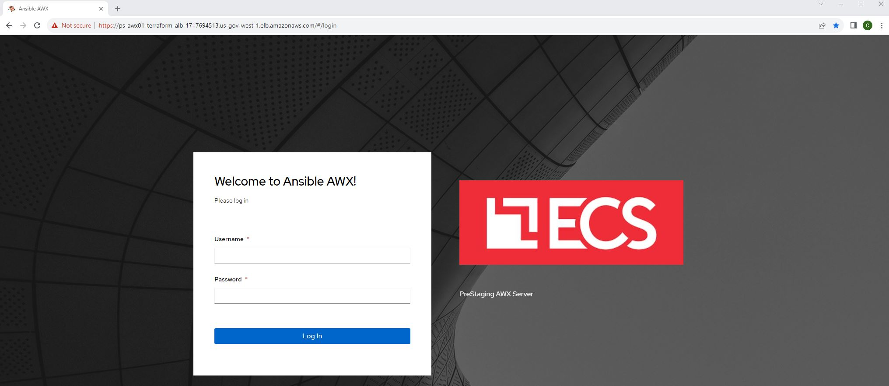
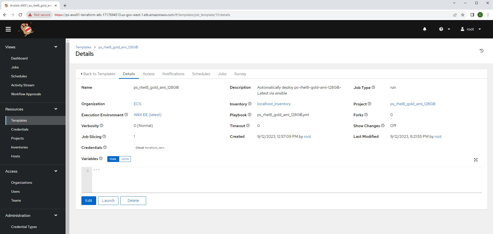
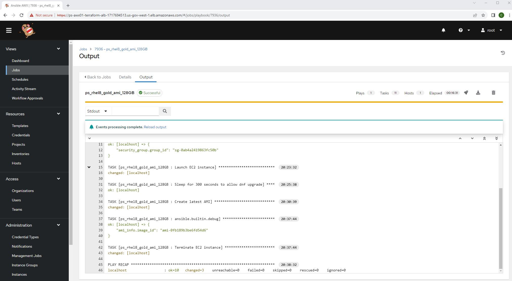
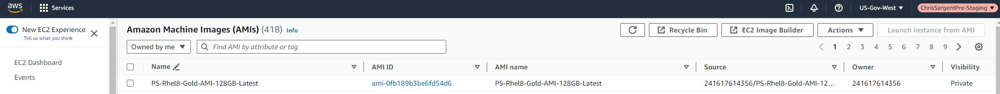

* This repository contains ansible role to deploy and EC2 from AMI, perform dnf upgrade and then create a new AMI-Latest and finally delete the deployed EC2 instance for an optimal GOLD AMI. For any additional details or inquiries, please contact us at csargent-ctr@ecstech.com.

# Prerequisites
* Add user_data.sh host script
1. Embed in ec2 that original AMI is created from
2. ssh in
3. sudo -i 
4. mkdir -p /root/scripts/user_data
5. vim /root/scripts/user_data/user_data.sh
```
#!/bin/bash
dnf clean all
dnf makecache
dnf upgrade -y
```
6. Create AMI

# This project is run from PS-AWX
* Note that AMIs have a script placed in /root/scripts/user_data/user_data.sh which performs the update
* You can tail -f /root/scripts/user_data/user_data.log to verify on the EC2 deployed
1. https://ps-awx01-terraform-alb-1717694513.us-gov-west-1.elb.amazonaws.com



2. Resources > Templates > ps_rhel8_gold_ami_128GB



3. Views > Jobs > Your job id 



4. https://console.amazonaws-us-gov.com/ > EC2 > AMI > Owned by me > PS-Rhel8-Gold-AMI-128GB-Latest

 
